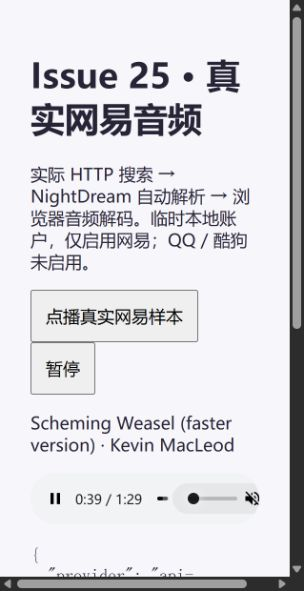

# Issue #25 验收记录

日期：2026-10-05（Asia/Shanghai）。范围：T06 音乐平台同录音可靠完整版自动解析。#23、#24 已 CLOSED。本票不代表 #19 总规格、B 站回退或 G7/G8 真机验收完成。

## 验收对照

| #25 条件 | 实现与证据 |
| --- | --- |
| 只自动尝试已确认同录音；试听/未知/不可用不成功 | NightDream 从按用户隔离的搜索会话取得所选目录和已有同录音组，再验证 sameRecording。客户端不能上传任意候选；不确定版本只可点播自身。真正 adapters 判断完整性，只有 full 成功 |
| 首个可靠完整版即返回，不等最高音质，迟到不改来源 | 网易/QQ/酷狗并行，各平台内部串行，沿用 registry 开关/能力/熔断/并发。选定后取消其他请求并冻结响应快照；HTTP 测试验证高优先级网易较慢、QQ先成功及迟到缓存隔离；真实 ArkTS 当前音轨不被迟到结果替换 |
| 可调总预算、给 B 站留余量、明确终态 | 总预算默认10秒，音乐平台阶段最多7秒，预留3秒。候选 URL+详情+正文共用其来源 deadline，且受阶段剩余预算限制。返回 success/exhausted/timeout/cancelled；客户端自动请求不重启网络重试预算。定时器同 tick 的边界竞态已回归修正 |
| 未启用 B 站时可接续结果和证据 | playback 带剩余预算和逐项完整性/匹配/失败证据，continuation 明示 stage=bilibili、enabled=false、eligible、目录及候选引用；不发起 B 站请求。后续 T07 必须接续剩余预算而非重新计时 |
| 目录和收藏身份稳定，实际来源可见，非网易不下载 | 客户端保持 catalogRef/mediaRef/neteaseId、标题、歌手、封面和歌词目录身份；只更新 playbackRef/playbackSource，正在播放页显示实际来源。跨源结果不触发网易 cache/download；相同网易目录/音频可靠完整版仍走旧入库链。队列重试沿用原目录，封面更新保留解析上下文 |
| 实际 HTTP 与客户端点播及常规平台真实样本 | 真实鉴权/SQLite/HTTP/编排/adapters → 实际 ArkTS 搜索点播、API、队列、播放器。覆盖先失败后成功、全部失败、试听/未知跳过、预算、取消和迟到。真实网易搜索/URL/详情 → 实际自动编排 → 浏览器解码和播放进度，见下表和截图 |

## 已通过

- NightDream 全量：44 个测试文件 / 238 项通过；TypeScript/Vite 生产构建通过。随后完善来源 deadline、加入第8个场景并修复定时器竞态，最终定向 HTTP/身份/完整性 3 文件 / 37 项全部通过；来源并发饱和补查和自动重试主机检查通过。未把旧全量次数写为新增场景后的次数。
- `check-automatic-playback.mjs`：实际合并结果主行点播、失败后 QQ 成功、全失败、试听/未知跳过、首个完整版、迟到不替换、预算、切到本地取消旧 HTTP、原目录恢复、来源文字、非网易下载隔离及网易回归通过。Kit AVPlayer/存储/下载边界受控，不宣称鸿蒙原生解码。
- `check-audio-integrity.mjs`、`check-aggregate-search.mjs`、`check-media-identity.mjs`、`check-online-queue.mjs`、`check-playback-recovery.mjs` 通过。展开来源手动点播仍只解析具体资源；本地和原网易下载/队列/收藏回归沿用实际业务检查。
- API 23 `assembleHap --no-daemon --stacktrace`：完整 ArkTS 类型检查、打包和签名成功，未修改原有签名配置，未使用 `--no-type-check`。首次新增取消回调的 Error 类型被 ArkTS 拒绝，已改为具体 ApiError；一次构建日志 EBUSY 后重试成功。工程原有弃用/异常提示仍在。
- 最终签名 HAP：`entry/build/default/outputs/default/entry-default-signed.hap`，SHA256 `B9FA14610F0B6E04461DD0AF57CAEE509D722D48178B52DCAF953F1D0B2DBF1A`。
- 两仓库 `git diff --check` 通过；临时测试 SQLite、服务和构建/测试/issue 文本清理，保留脱敏截图、样本记录和可复查脚本。

## 真实平台与设备

真实取样走本地原 api-enhanced 服务，NightDream 使用临时本地鉴权/SQLite；第三方搜索、播放 URL、详情均是实际提供方 HTTP，没有替换平台响应。临时用户不绑定账号，不修改生产账户。仅启用网易，QQ/酷狗未启用，不宣称实际跨平台换源成功率。源链接和 API Key 不写入持久证据。

| 样本/层次 | 实际观察 |
| --- | --- |
| 网易 33984241 · Kevin MacLeod · Scheming Weasel (faster version) · Comedy Scoring | 实际合并搜索选择原目录；自动解析 success，audioIntegrity=full，reason=provider_duration_and_non_trial。目录 dt=89070ms、音频 time=89070ms、freeTrialInfo=null；保留目录身份。浏览器 duration=89.07068s、readyState=4、error=null，paused=false，currentTime 从26.574168s推进到40.305556s；随后人工控制暂停。标题有版本限定，允许点播自身，不用它证明可跨版本匹配 |
| 网易 186016 · 晴天 | 实际 URL 为空、time=0，不作为成功；匿名样本没有获取音频 |
| 网易 347230、29764564、513791211 | 实际 freeTrialInfo 是试听对象，资源分别约35.03/35.03/20.035秒，不能作为可靠完整版；本轮未播放这些片段 |
| QQ/酷狗真实音频 | 本轮未启用；完整性缺证据仍是 unknown。跨平台成功/失败仅在真实业务 HTTP + 受控第三方边界验证 |
| HarmonyOS 真机 | hdc list targets 为空；未安装和操作设备，AVPlayer、后台/锁屏、真机 SQLite 与原生触摸未验证，仍属于 G7/G8 |

复查命令和配置见同级 `NightDream/docs/automatic-playback.md`。真实平台结果随版权、凭证和接口状态变化；上述只是本轮样本，未测整曲播放完毕，也不表示曲库覆盖率。

按用户指令：更新本票 checklist/验收评论，关闭并独立回读 CLOSED，再分别提交/push DreamMusic 与 NightDream 本票文件，回读远端 master SHA。原有 `build-profile.json5` 修改及 `.scratch/` 保留，不纳入提交。
