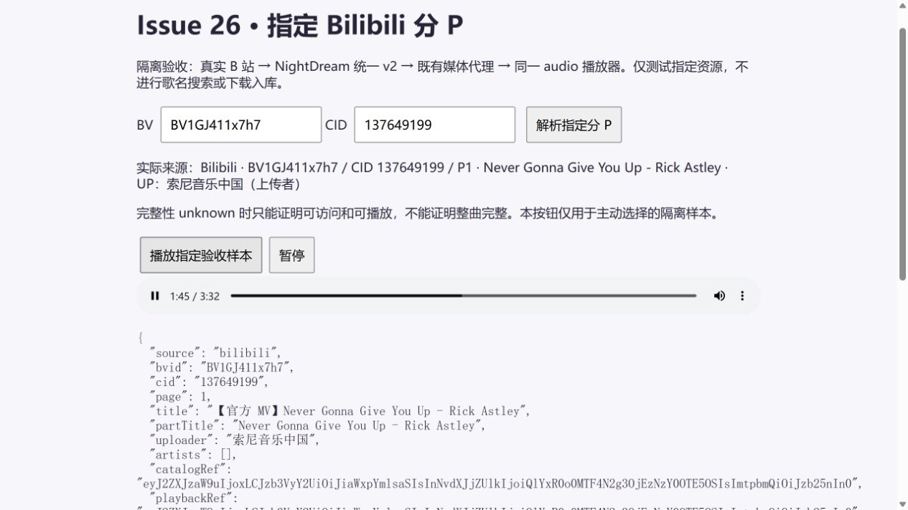

# Issue #26 验收记录

日期：2026-10-05（Asia/Shanghai）。范围：T07 指定 Bilibili BV/CID 的音频适配、统一接口及媒体传输。前置 #24 已 CLOSED。自动歌名搜索/录音匹配、总预算内 B 站回退、真机与后台验收属于其他工单，本票不代表 #19/G4 全部完成。

## 验收对照

| 条件 | 实现与证据 |
| --- | --- |
| 指定 BV/CID 正确往返、多分 P 不串曲 | 新 BilibiliAdapter 经原注册表与编排调度；详情核对 BV 和 pages CID，播放用同一 CID。真实网关 HTTP 用受控 P1=111、P2=222，选择 P2 后返回 P2 详情及音频，旧 id/cid hint 不覆盖引用；错误 CID 不请求音频、不回退首 P |
| URL、时长、形态、完整性及身份分别表达 | 沿用 v2 mediaRef/catalogRef/playbackRef 与 playbackSource，保留 resource 的 BV/CID/page/视频名/分 P 名/uploader；artists 不填 UP 主。播放携带实际 timelength、AAC/MP4/DASH representation 和 audioIntegrity；真实样本未知不升格为完整 |
| 隔离样本显示来源并实际播放、生产沿用统一接口 | `NightDream/scripts/check-bilibili-live.mjs` 是窄范围夹具，以临时鉴权/SQLite走真实网关 → 编排 → 适配 → 原媒体代理 → 同一个浏览器 audio，允许主动播放标注 unknown 的验收样本。生产 ArkTS API/队列继续使用 mediaRef，缺代理明确失败、未知音频不交给 Kit、不走网易入库；没有新增客户端 B 站协议或浏览入口 |
| DASH、必要请求头、重定向、Range及明确失败 | 选择支持的 AAC DASH audio，不冒充 durl 视频/Dolby。Referer/User-Agent 留服务端，代理实际 HTTP 重定向后仍传 Range/If-Range，返回206/Content-Range；缺音频、不支持格式、上游返回错误身份和媒体503均有反例。连接/空闲超时与持续流/停滞流验证通过 |
| URL与真实播放分开、至少一个指定分 P 有进度 | 真实样本记录如下，浏览器播放推进超过100秒且无错误；URL取得和音频 unknown 分别显示。只验证可播放，没有测到 ended，不宣称整曲完整或与外部音乐目录是同录音 |
| 受控HTTP与既有调度边界、无下载/过期持久化 | 真实鉴权/SQLite/v2/编排/适配器，仅第三方响应受控；媒体是实际本地HTTP。验证禁用、并发饱和、歌词能力不支持、无代理、两次请求重新解析和 unknown 不计 full 成功；来源默认关闭。无新增下载链、无直链持久化 |

## 真实网络与浏览器

- 指定样本：[BV1GJ411x7h7 · P1](https://www.bilibili.com/video/BV1GJ411x7h7/)；CID `137649199`，标题 `Never Gonna Give You Up - Rick Astley`，UP 主 `索尼音乐中国` 仅标为上传者，artists=[]。
- 真实视频选定分 P 时长 213000ms，playurl timelength=212393ms；DASH duration=213000ms，AAC `mp4a.40.5`、representation 30216；浏览器实际 duration=212.393833s。
- 成功播放观测：currentTime `19.113146 → 61.641203 → 105.758588` 秒，paused=false、readyState=4、error=null；主动暂停时105.898646秒。
- `audioIntegrity=unknown`、reason=`missing_evidence`。来源/分 P/DASH 与时长证据保留；响应没有显式非试听标记，未测完整播放完毕。真实样本是 P1，P2 与错 CID 是受控测试，不混称为真实多分 P 验证。
- 首轮播放中断暴露媒体响应总超时及人工等待时短时引用过期：代理已改为连接/空闲超时，夹具将引用TTL设120秒。之后重新解析并取得上述稳定进度。生产TTL仍默认30秒，可配置；过期后的恢复属G7。
- 所有第三方请求均是真实提供方HTTP，没有平台假响应。临时本地用户/SQLite只用于隔离鉴权；源直链、签名、凭证不写入持久证据，未下载媒体入库。

## 验证状态

- NightDream：最终全量45个测试文件/249项全部通过，TypeScript/Vite生产构建通过；新增指定资源、真实HTTP媒体重定向、持续/停滞传输检查。测试输出仍有原有SQLite实验性提示及Controls测试的localhost:3000非断言网络提示，没有测试失败。
- `check-media-identity.mjs`：实际 ArkTS NetEaseApi/ApiClient消费B站v2/代理引用，unknown不交给Kit、不触发网易下载及缓存；本地/原网易/QQ身份、队列、歌词与迟到响应回归。
- `check-audio-integrity.mjs`：完整性四态、实际受控WAV、媒体失败、同资源重试及本地/旧接口回归通过。
- 本票没有修改ArkTS生产源代码，未重复构建HAP；主机Kit替身不是鸿蒙原生解码证据。未执行鸿蒙真机、后台/锁屏与AVPlayer验收。
- 保留原有build-profile.json5和.scratch/，不纳入本票提交。测试临时服务/账户/SQLite和issue文本收尾清理，只保留脚本、脱敏截图和验证记录。

按用户要求更新checklist、评论并关闭后独立回读CLOSED，再分别提交/push NightDream与DreamMusic本票文件。
