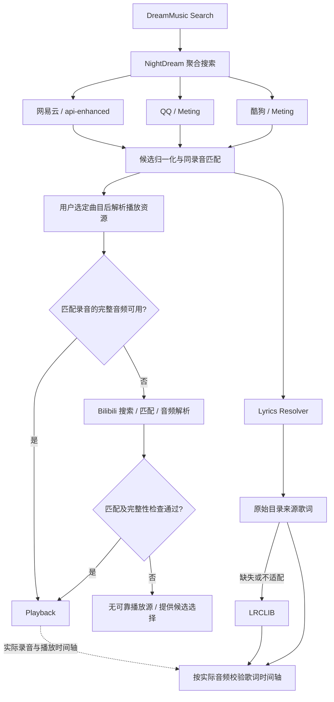

# 多平台搜索、同录音匹配、Bilibili 回退与歌词解析调研

日期：2026-10-04。状态：调研完成，三轮共八项产品决策已确认。后文保留调研时的建议及证据；最终目标以 [多源匹配播放规格](../specs/multi-source-matching-playback.md) 和 [ADR-0009](../adr/0009-recording-matched-playback-and-source-identity.md) 为准，业务代码尚未实现。

实施拆分：已形成 [G1—G8 目标规格](../specs/multi-source-matching-goals.md) 并发布至 [GitHub #19](https://github.com/Ivy-reverie-vine/DreamMusic/issues/19)。旧 #1—#8 的状态与验收要求没有被本次发布自动修改。

依据：当前 DreamMusic/NightDream 源码、工作区内 BBPlayer/MusicFree 源码，以及下列上游项目的一手文档和源码。本轮没有修改业务代码、开启来源、安装依赖或执行真实音频播放测试。已有验收记录单独注明，不算本轮复测。

## 结论

用户提出的结构在工程上可行。现成项目已经分别实现多平台接口、播放失败换源、音乐元数据匹配 B 站视频、独立歌词匹配；本次核查未找到一个能够直接替换 NightDream、同时满足严格版本匹配和完整音频验证的成品。

建议继续以 NightDream 为唯一在线编排入口，复用现有 api-enhanced 与 Meting，在其上补聚合搜索、录音匹配、完整性判定、Bilibili 适配与 Lyrics Resolver。最难的部分是判断是否同一录音及是否完整，不是增加一个平台 API。

歌词请求可以与音频解析并行，歌词失败不阻塞起播；实际选用的音频会决定能否沿用原歌词时间轴。用户已确认自动换源仅限同一录音，其他版本和不确定候选由用户选择；具体候选交互尚待设计。

## 1. 现有工程能复用什么

| 当前证据 | 含义 |
| --- | --- |
| `NightDream/server/music/musicOrchestrator.js` 的 `dispatchMediaRef()` 只把一个来源交给调度循环 | 目前没有同曲跨平台换源；不能把网易数字 ID 直接传给 QQ/酷狗 |
| `dispatchFromSources()` 的搜索流程遇到正常响应即返回 | 现有逐源降级不等于三平台并行聚合搜索 |
| 播放成功条件是响应正常且首条 URL 非空 | 尚不能排除试听，也不能据此证明音频完整、匹配正确或 CDN 可播 |
| `NightDream/server/mediaContract.js` 的 `mediaRef` 编码来源与来源 ID，播放响应沿用请求引用 | 回退实现必须显式返回实际来源，不能在原 `mediaRef` 下悄悄塞另一个平台的音频 |
| `NightDream/server/music/sources/metingAdapter.js`、`scripts/meting-runtime/` 和测试启动脚本 | 已有 QQ/酷狗接入及本地 Meting sidecar，不必另起一套聚合平台 |
| `api-enhanced/module/song_url_match.js` 已调用 `@neteasecloudmusicapienhanced/unblockmusic-utils` 的 `matchID` | 工作区已有网易 ID 驱动的换源入口，但其返回结构与现有来源中立契约不同，不宜直接作为所有平台的统一身份层 |

2026-10-04 的既有验收记录记载：网易罗大佑《童年》返回约 47 秒试听；QQ 与酷狗有真实可播样本，也有空 URL 样本。这支持“把完整性作为独立判断”的必要性，不代表跨源链路已通过验证。详见 [既有验收记录](../../../NightDream/docs/music-source-validation-2026-10-04.md)。

现有 [ADR-0005](../adr/0005-audio-source-boundary.md) 把 URL 为空定义为播放/下载失败；`AGENT.md` 和 v2 契约要求详情、播放、封面、歌词保持同一来源引用。新提议涉及重开这项行为决策，并把“原始目录身份”和“实际音频身份”显式区分。NightDream 统一入口这一架构边界可以继续保留。

## 2. 现成项目比较

| 项目 | 已查到的能力 | 对 DreamMusic 的价值与不足 |
| --- | --- | --- |
| [Meting](https://github.com/metowolf/Meting) / [Meting-API](https://github.com/metowolf/Meting-API) | 网易、QQ、酷狗等统一 search/song/url/lyric/pic 接口；当前主项目为 Node.js | 优先继续使用现有接入。统一接口并不提供可靠的跨平台录音身份，也不保证每首歌都返回完整音频 |
| [Listen 1](https://github.com/listen1/listen1_chrome_extension) | 多平台聚合搜索，播放失败后搜索其他来源 | 最接近整体产品流程，适合参考编排；匹配与运行环境需要改造 |
| [UnblockNeteaseMusic/server](https://github.com/UnblockNeteaseMusic/server) | 网易 ID 驱动的匹配库，QQ/酷狗与 `bilivideo` 来源，支持指定来源顺序 | 可作现成换源候选解析器或对照基线；不是严格同录音识别服务 |
| [BBPlayer](https://github.com/bbplayer-app/BBPlayer) | 网易/QQ 歌单转 B 站视频；B 站音频解析；网易/QQ/酷狗歌词独立匹配 | 最相关的 B 站参考。工作区已有源码；借鉴服务逻辑，不移植 React Native/Media3 播放层 |
| [MusicFree](https://github.com/maotoumao/MusicFree) | 插件化搜索/音频/歌词接口，播放失败后寻找相似歌曲，歌词跨插件补全 | 参考音源与歌词解耦、换歌取消旧请求；播放器本体不是附带稳定平台实现的统一后端 |
| [music-lib](https://github.com/guohuiyuan/music-lib) | Go 统一搜索、歌曲解析、下载 URL、歌词接口，包含 Bilibili | 能作为独立适配服务候选，但增加 Go 运行时和维护面；对于已有 Node.js 接入不优先替换 |
| [bili-music](https://github.com/YOUYUDAWANG/bili-music/blob/main/ARCHITECTURE.md) | B 站音频 + LRCLIB 歌词的实际工程组合 | 证明组合已有实践；作者仍把歌词匹配质量列为待真机验证，不能视为 DreamMusic 的验收结果 |

仓库元数据补查：GitHub API 在本轮返回的最近 push 日期为 UNM 2026-09-28、music-lib 2026-09-16、Meting 2026-03-29、Listen 1 2025-06-17；均未归档。这只是仓库状态，不能证明平台接口可用。

复用代码的许可证元数据：Meting、Listen 1、工作区 BBPlayer 为 MIT；UNM 为 LGPL-3.0；MusicFree 与 music-lib 为 AGPL-3.0。这里只记录选型事实，未作法律判断。BBPlayer 本地 HEAD 为 `e5e2e38a`（2026-08-29），MusicFree 为 `d118b18`（2026-06-20）；下面对这两个项目的细节判断针对本地快照。

### 关键源码发现：不能把“有匹配函数”当作可靠匹配

- [Listen 1 `loweb.js`](https://github.com/listen1/listen1_chrome_extension/blob/master/js/loweb.js)：`allmusic` 并行查询后交错合并列表，未做同录音去重；`bootstrapTrack()` 的跨源候选主要比较标题与歌手完全相等，源码仍把时长/MD5 比较列为 TODO。
- [UNM `select.js`](https://github.com/UnblockNeteaseMusic/server/blob/enhanced/src/provider/select.js)：从前五个结果里找时长差小于五秒的候选，找不到则取第一条。[`bilivideo.js`](https://github.com/UnblockNeteaseMusic/server/blob/enhanced/src/provider/bilivideo.js) 的候选归一化没有提供时长字段，不能依靠该流程证明同一录音；视频流解析使用 BV/CID 和 DASH audio。
- BBPlayer `apps/mobile/src/lib/services/externalPlaylistService.ts`：本地实际调用的是 `findBestMatchSimple()`，按分区过滤、时长差不超过 20 秒后取第一条。另一个标题/时长评分函数虽存在，但不是这里的实际调用路径。它能作为候选生成参考，不能照搬成严格自动替换依据。
- BBPlayer `lyricService.ts` 独立查询网易、QQ、酷狗歌词，使用 `Promise.any` 返回先成功的来源并取消其他请求。当前检查范围内没有 LRCLIB 集成；不要把 BBPlayer 与 bili-music 的实现混为一谈。
- MusicFree `trackPlayer/index.ts` 有播放失败后的 `getSimilarMusic()` 链路，`lyricManager.ts` 有跨插件歌词搜索；这些流程依赖插件实际提供的平台能力。
- [music-lib Bilibili 搜索源码](https://github.com/guohuiyuan/music-lib/blob/main/bilibili/song.go)：搜索后逐条获取详情，默认取首个分 P，`Artist` 来自 UP 主。DreamMusic 不能把 UP 主直接视为音乐演唱者，也要留意逐项详情请求的延迟。

## 3. 建议拆开的三个判断

### 同一歌曲：应讨论“同一录音版本”

相同歌名可能对应不同歌手；相同歌手也可能有录音室、现场、重录、伴奏、Remix、加速版。建议把同一录音作为自动替换标准，保留原始平台 ID，先归一化歌名/歌手/版本标记，再综合时长、专辑与可用的录音标识判断。

时长只是辅助证据。没有版本冲突且证据充分才自动切换；低置信度候选可以展示，但不应默认为正确。不要删除标题里的 Live、伴奏等版本信息后再声称匹配成功。评分阈值需要样本校准，本轮不臆定百分比。

### 完整音频：URL 非空不是充分条件

建议解析结果至少区分：已判定完整、已知试听、完整性未知、不可用。检查来源明确的试听/付费/限制字段、声明媒体时长与目录时长、实际媒体响应和格式；小范围 Range 探测只能证明部分字节可访问，不能证明整曲完整。

“未知”不能自动改成“完整”；来源没有足够字段时保留证据不足状态。自动切换可以先尝试同录音的其他平台，常规来源耗尽或达到总时间预算后再进入 B 站。解析应按点播需要执行，避免搜索每一条结果就探测三个平台全部 URL。

Bilibili 是候选来源，不是必定成功的终点：还需处理无匹配视频、错误分 P、翻唱/MV 前后奏、空音频、请求失败和过期链接。引用应保存 BV/CID，URL 在播放时获取并按失效信息刷新；Referer/UA 等需求由适配器及现有媒体代理封装。不要照搬其他项目的固定 URL 有效期作为契约。[bili-music 的工程记录](https://github.com/YOUYUDAWANG/bili-music/blob/main/ARCHITECTURE.md)和 [UNM 的解析实现](https://github.com/UnblockNeteaseMusic/server/blob/enhanced/src/provider/bilivideo.js)可作参考，鸿蒙播放尚需独立验证。

### 歌词：内容匹配与时间轴匹配分开

建议“原平台”明确指用户最初选择的目录条目所属平台，即使音频最终来自 B 站，也不丢失原曲歌名、歌手、专辑和歌词查询身份。Lyrics Resolver 优先按该条目精确取歌词，缺失时查 LRCLIB；是否加入其他已匹配平台作为中间回退，可后续决定。

[LRCLIB 当前路由源码](https://github.com/tranxuanthang/lrclib/blob/main/server/src/routes/get_lyrics_by_metadata.rs)以歌名和歌手查询，专辑与时长为可选字段；返回普通歌词、同步歌词和纯音乐标记。[仓储查询源码](https://github.com/tranxuanthang/lrclib/blob/main/server/src/repositories/track_repository.rs)在提供时长时使用正负两秒范围。建议优先传入完整目录元数据，精确查询未命中再搜索候选并自行校验；不要把 B 站视频标题或 UP 主直接当成原曲信息。

LRCLIB 没命中不代表没有歌词，命中也不保证一定有同步歌词。不能根据它的存在承诺中文曲库覆盖率。原歌词与 B 站音频有固定前奏差时可调整偏移；MV 有中段对白、删节或变速时单一偏移不足，需降级显示或人工选歌词，不应显示成已同步。

## 4. 建议的最小新增边界（尚未定案）

1. `SearchAggregator`：三平台并发查询、各自超时、部分成功、候选归一化；已确认同录音合并展示、可展开来源，分页方式尚待设计。
2. `RecordingMatcher`：输出候选、匹配证据与版本冲突；平台 ID 不互换。
3. `PlaybackResolver`：按候选解析音频、区分试听/未知/完整，必要时调用 Bilibili；包含总超时和过期重解析。
4. `LyricsResolver`：目录来源 → LRCLIB；独立缓存歌词身份及音频时间轴适配结果。

建议在概念上保留三种身份：`catalogRef`（用户选的目录条目）、`playbackRef`（实际音频）、`lyricsRef`（歌词条目）。名字仅为提议；现有 `mediaRef` 继续标识具体来源资源。是否新增上层引用、如何兼容 v2，以及离线文件如何保存来源，须在产品决策后设计。

## 5. 验证路线与未决问题

下一步原型应先覆盖固定样本：同名异曲、同歌手 Live、翻唱、正常完整版、明确试听、无时长数据、B 站多分 P/MV 前奏、纯音乐及歌词空结果。记录匹配证据、实际来源、完整性状态、起播耗时和歌词时间轴；另做鸿蒙 AVPlayer 的真实播放与 URL 过期恢复。

本轮确认的是源码能力和架构可行性，未测 B 站当前账号/网络下的成功率、LRCLIB 中文覆盖率或端到端时延。

### 第一轮已确认（用户回复“all ok”）

1. 自动换源只接受同一录音；翻唱、现场和不确定候选交给用户选择。
2. 搜索结果采用“同录音合并一条、可展开来源”；仅合并证据充分的条目，不确定候选独立显示。

对应术语已写入 `CONTEXT.md`。此确认不代表自动接受报告中的所有实现建议，也不代表已授权开始业务实现。

### 第二轮已确认（用户再次回复“all ok”）

3. 找到可靠完整版后立即播放，不额外等待更高音质。普通平台优先、失败再进入 B 站；整次自动解析暂以 10 秒为可调等待目标，超时提供重试或来源选择。10 秒不是已测得性能，也不包含播放器后续缓冲时间。
4. B 站自动回退只接受无明显额外片段的同录音候选；带额外前后奏、对白或剪辑的 MV 留给用户手动选择。
5. 第一阶段完成聚合搜索、同录音匹配、完整播放与歌词验证。QQ、酷狗和 B 站暂不自动下载入库；保留现有本地功能与网易下载流程。跨源下载和入库迁移留到后续阶段。

### 第三轮已确认（用户第三次回复“all ok”）

6. 同录音换源保持原曲歌名、歌手、封面和收藏身份，只更新实际音频来源标识；手动选择其他录音版本作为独立条目。此处定义身份原则，不提前扩展第一阶段的在线收藏持久化功能。
7. 手动选择只作用于当前播放队列条目；下次从搜索发起播放重新自动解析，不建立永久跨源绑定。
8. 歌词按“原目录平台 → LRCLIB”获取；有可靠同步歌词才滚动，只有文本或时间轴无法确认时静态显示，没有则显示“暂无歌词”；均不阻塞播放。手动选取带额外片段的 MV 不自动套用原曲时间轴，第一阶段不增加歌词编辑器。

八项决定已汇总到最终规格并形成 ADR-0009，领域术语同步到 `CONTEXT.md`。本轮调研与设计讨论收敛；具体 API 字段、匹配阈值和性能参数仍须在实现时据样本和兼容性校准，不再作为未回答的产品问题。
