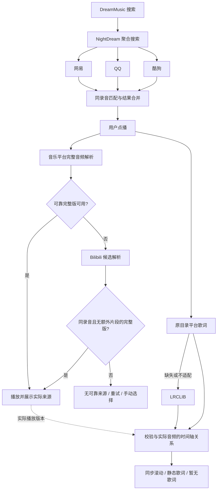

# 多源搜索、同录音换源与独立歌词解析

状态：产品设计已确认，待实现与验证。日期：2026-10-04。

实施目标已按 to-spec 拆分为 G1—G8，见 [实施规格与目标拆分](multi-source-matching-goals.md)；总规格已发布为 [GitHub #19](https://github.com/Ivy-reverie-vine/DreamMusic/issues/19)，标签为 `ready-for-agent`。

依据：用户提出的网易 / QQ / 酷狗搜索 → 同曲匹配 → 完整音频或 Bilibili 回退 → Playback，以及原平台 / LRCLIB 歌词链路；三轮共八项产品取舍均已确认。

相关文档：[调研与源码证据](../research/multi-source-matching-feasibility-2026-10-04.md)、[ADR-0009](../adr/0009-recording-matched-playback-and-source-identity.md)、[领域词汇表](../../CONTEXT.md)。本规格定义本轮目标；旧规格和旧单来源契约的差异按 ADR-0009 解释，不代表代码已迁移。

## 目标与第一阶段范围

用户搜索一次即可看到网易、QQ、酷狗的结果；同一录音仅展示一项，可展开查看平台来源。点播时自动寻找可靠完整版，音乐平台均失败或在等待预算内不可用时尝试 Bilibili。歌词独立获取，缺失不阻塞起播。

第一阶段包括聚合搜索、录音匹配、完整性判定、常规平台与 B 站播放解析、来源展示、当前队列条目的手动来源选择，以及原平台 → LRCLIB 歌词回退。

保留本地音乐和现有网易下载入库能力；QQ、酷狗和 B 站音频暂不自动下载入库。本阶段不增加永久手动绑定、跨平台账号收藏同步或歌词编辑器。现有收藏行为不因同录音音频换源而改变；新增在线收藏持久化不由本规格自动引入。

## 已确认的八项行为

| 编号 | 决定 |
| --- | --- |
| 1 | 自动换源仅限同一录音；翻唱、现场、重录、伴奏等不同版本及不确定候选交给用户选择 |
| 2 | 已确认同录音的搜索结果合并一项，可展开来源；证据不足的候选独立展示 |
| 3 | 找到可靠完整版立即播放，不继续等待更高音质；常规音乐平台优先，B 站兜底；自动解析暂以 10 秒为可调等待目标 |
| 4 | 带额外前后奏、对白或剪辑的 B 站 MV 不自动选用，作为手动候选 |
| 5 | 第一阶段的新来源仅在线播放，跨源自动下载入库后续设计 |
| 6 | 同录音换源保持原曲歌名、歌手、封面和收藏身份，只更新实际音频来源标识；不同录音是独立条目 |
| 7 | 手动来源只对当前队列条目生效；从搜索重新播放时重新自动解析，不形成永久绑定 |
| 8 | 歌词按原目录平台 → LRCLIB 获取；可靠同步歌词滚动，文本或时间轴不确定时静态显示，没有则显示“暂无歌词”；不阻塞播放 |

## 用户流程

### 搜索与录音匹配

- 来源查询并发执行并隔离超时；单个平台失败时展示其他来源结果，并保留查询不完整的状态，不能把失败说成没有结果。
- 合并依据是录音版本，不是歌名相同。比较归一化标题、演唱者、版本标记、时长、专辑等可用证据；时长和关键词相似只能辅助判断。
- 不删除 Live、伴奏、Remix 等版本信息再作无差别匹配。缺失时长或演唱者、版本冲突、证据不足时，不强行合并。
- 合并后保留每个平台的原始条目和引用。搜索阶段不逐曲解析所有平台的音频 URL，点播时再获取短时资源。
- 用户点播后，代表该次选择的目录条目保持稳定；后到的搜索结果或实际音频换源不能替换正在播放的歌名、封面和条目身份。

### 音频解析与完整性

- 候选必须分别通过录音匹配与完整性判断。区分已判定完整、明确试听、完整性未知和不可用；未知不视为完整，试听不视为完成回退。
- 使用平台试听/限制字段、资源时长、目录时长和媒体可读性等证据；适配器记录判断依据。URL 非空、HTTP 200 或前若干字节可读，都不足以单独证明整曲完整。
- 同录音的普通平台候选优先；在这些候选不可用或耗尽其等待预算后进入 B 站阶段。为 B 站保留解析时间，不能等整个 10 秒耗尽才开始兜底。
- 自动解析暂以总计 10 秒为可调目标，覆盖平台解析和 B 站回退，不按每个来源重复累计 10 秒。播放器获取资源后的缓冲耗时单独记录；该预算不是已验证的端到端性能承诺。
- 首个满足条件的完整版即可交给播放器；不要为了更高音质拖延，也不在开始播放后因较慢候选返回而擅自切源。
- 超时、无可靠候选或所有来源失败，明确结束本次自动解析，提供重试与来源选择。切歌后取消旧工作，迟到结果不能启动旧歌曲或覆盖新曲歌词。
- B 站候选检查 BV/CID 和具体分 P，不把 UP 主当作演唱者。带额外片段或录音不确定的结果转入手动候选。
- 实际播放 URL 是短时资源，按其有效信息缓存；失效后重新解析同一候选。手动选择的候选失效时不能静默跳到另一录音。

### 手动来源与身份

- 展示原曲信息，同时提供实际来源标识；换源结果必须能追溯到实际音频条目。
- 手动指定同录音来源只影响当前队列条目，重新搜索并点播不复用这次手动选择。
- 手动选择另一录音时，使用该录音自己的信息作为独立条目。不能把“用户愿意播放”等同于“已验证为原录音”，也不能把不确定候选写进原曲永久匹配关系。
- 网易来源条目的身份不能承载其他平台音频的下载入库。即使目录信息来自网易，只要实际音频来自 QQ、酷狗或 B 站，第一阶段就不进入旧网易数字 ID 下载链。

### 歌词

- “原平台”指此次用户选择的目录条目所属平台，与实际播放来源分开。原平台歌词缺失或不适配时再查 LRCLIB，不额外增加其他平台歌词搜索分支。
- LRCLIB 使用目录条目的歌名、歌手、专辑和时长寻找候选；不直接以 B 站视频标题、UP 主替代这些字段。
- 歌词内容相同不证明同步时间轴相同。可靠同步歌词才跟随播放进度滚动；只有文本或音频存在不能确认的前奏/剪辑差异时静态显示。
- 手动选择带额外片段的 MV 不直接套用原曲时间轴；第一阶段不提供歌词编辑器或自动对白剪切。
- 请求失败与查无歌词分别保留内部结果；界面允许重试，缺失时显示“暂无歌词”，都不终止音频播放。
- 缓存保留歌词来源及其与实际音频版本的关系；换源后重新检查时间轴适配，换歌后的旧结果不污染新曲。

## 工程边界与复用方向

NightDream 仍是唯一在线入口。继续使用 api-enhanced 与现有 Meting adapter；在来源能力层之上增加聚合、匹配、完整性检查和歌词编排。Bilibili 适配参考 BBPlayer 的服务逻辑，Listen 1 与 UNM 作为编排/候选解析参考；不能原样采用“找不到就取第一条”的匹配策略。

具体资源的 `mediaRef` 继续表示一个平台条目。新编排需要能分别表达目录引用、实际播放引用和歌词引用，且兼容旧客户端；不得在旧引用中隐式替换来源。字段名、路由、分页游标、内部缓存键和匹配阈值属于实现设计，不在本轮把未经验证的草案固化为 API 契约。

保留现有来源开关、并发限制、熔断与媒体代理。搜索失败、录音匹配失败、完整性未知、试听、音频解析失败、媒体传输失败与歌词失败应可区分，便于解释回退结果和定位问题。

## 验收范围

| 场景 | 预期与证据 |
| --- | --- |
| 三平台同录音 | 只显示一项，展开可见独立来源引用，点播后目录信息稳定 |
| 同名异曲、Live、翻唱、伴奏 | 不错误合并，不自动替换；人工选择其他录音成为独立条目 |
| 单个平台超时或拒绝请求 | 其他结果可用，显示部分查询状态，失败不伪装为空结果 |
| 普通平台返回明确试听 | 不按完整版成功处理，继续寻找可靠候选 |
| 缺失完整性证据 | 保留未知状态，不靠非空 URL 自动标记完整 |
| 常规平台成功 | 可靠完整版立即起播，不等待慢来源更高音质，不启动无必要的 B 站回退 |
| 常规来源失败、B 站可用 | 校验同录音与 BV/CID 后播放，显示实际来源；不触发网易下载链 |
| B 站多分 P、额外前奏/对白/剪辑 | 不误选分 P；有额外片段的候选不自动播放 |
| 全部失败或解析超时 | 在预算到期后结束自动工作，提供重试/手动选择，无迟到自动起播 |
| 手动来源与新搜索 | 当前队列选择有效，新搜索点播重新自动解析，无永久绑定 |
| URL 过期 | 重新解析所选资源；实际身份保留，不能拿缓存过期直链重复假成功 |
| 原平台有同步歌词 | 使用原歌词，并检查与实际播放音频时间轴是否适配 |
| 原平台歌词缺失、LRCLIB 命中 | 使用匹配歌词；只有普通文本时静态显示 |
| 手动 MV、时间轴不确定 | 静态歌词，无错误同步滚动 |
| 歌词全部缺失或请求失败 | 音频继续播放；缺失提示与请求诊断可区分 |
| 快速切歌 | 旧播放/歌词请求不覆盖新队列条目 |
| 本地与旧网易流程 | 本地离线播放不受影响；实际网易音频的既有下载入库仍可用 |

验收分层：纯逻辑测试覆盖匹配、完整性状态、身份和取消/超时；真实服务样本验证返回资源及错误；浏览器记录实际 `playing`、进度推进、来源和歌词；HarmonyOS 真机单独验证 AVPlayer、后台/锁屏和失效恢复。完整播放样本需有实际持续播放或整曲媒体检查证据；Range 探测只算可访问性证据。单样本成功不能推广为曲库覆盖率。

## 实施顺序与当前状态

1. 先设计兼容的来源身份契约与匹配样本集，区分目录与实际资源，避免后续入库串源。
2. 实现三平台聚合与保守合并，并提供部分成功和来源展开。
3. 实现完整性判定、解析预算和 B 站适配，再接入当前队列的手动来源选择。
4. 接入独立歌词回退与显示降级，最后验证原有功能和真实设备播放。

当前已完成调研、产品决策、术语、文档，以及 GitHub #19 总规格发布和内部目标 G1—G8 拆分。用户确认后已进一步发布 16 张独立工单 #20—#35，含 25 条原生阻塞关系；见 [工单发布索引](../../.scratch/multi-source-matching/README.md)。父 #19 的正文和状态保持原样。新链路代码、B 站成功率、LRCLIB 中文覆盖率、10 秒目标和鸿蒙真机均待验证。本规格不把既有单源测试记录当作新链路验收；未提交或推送代码。
